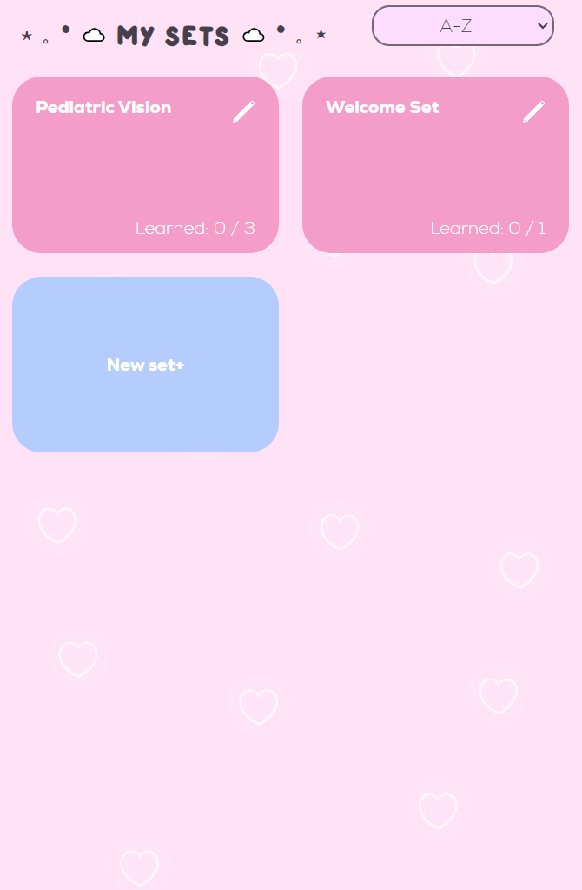
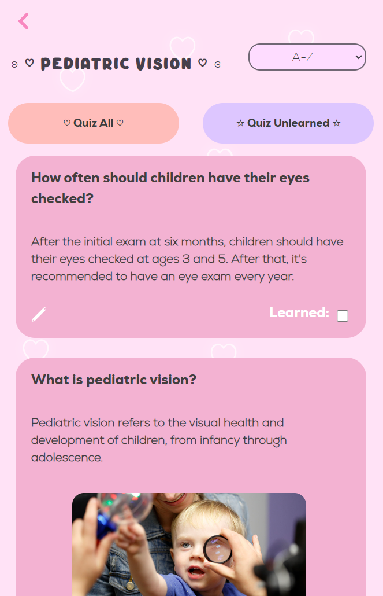
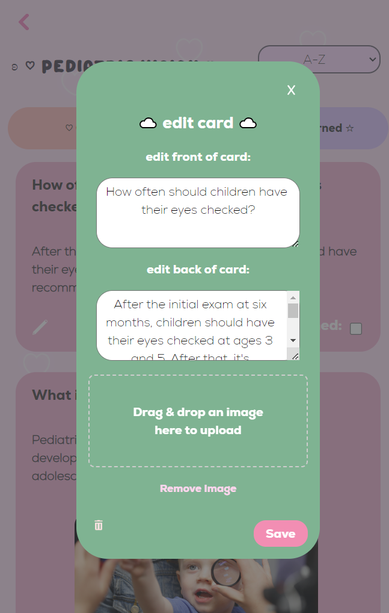
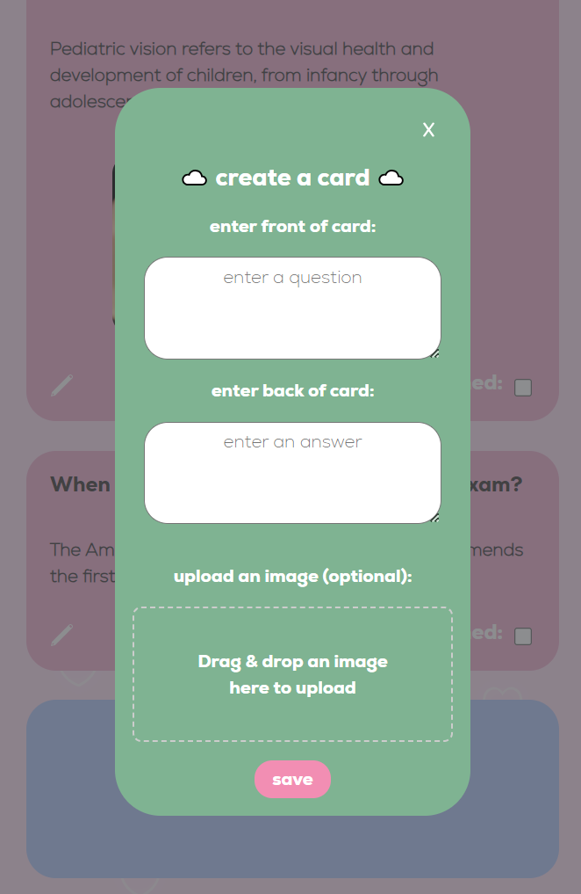
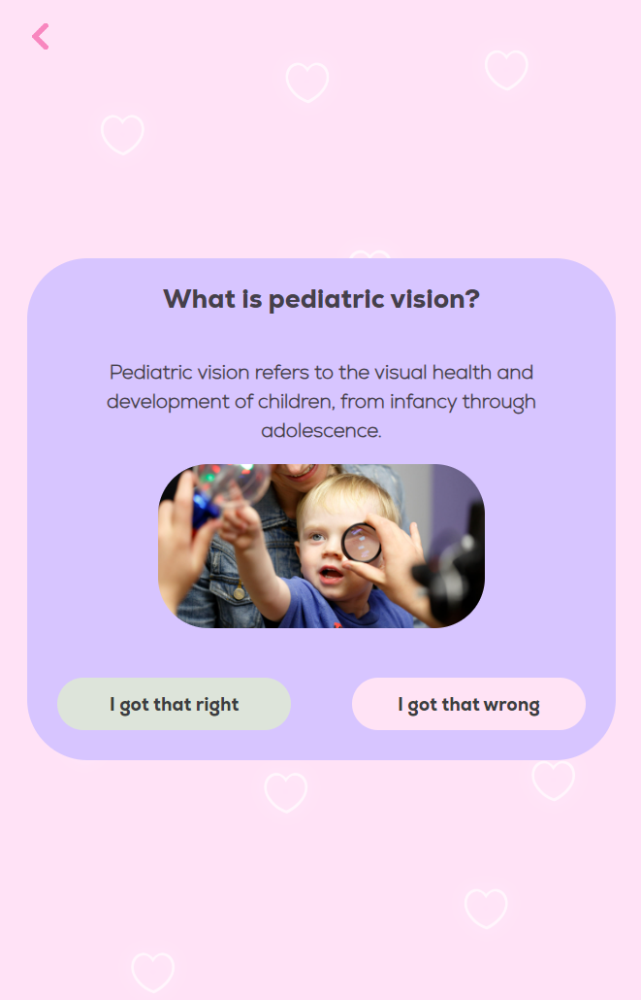

# flashRabbit 

This desktop flashcard application utilizes local storage to enable offline usage. This implementation encompasses a range of versatile features, facilitating the creation, editing, and deletion of sets and individual cards. Additionally, it supports image uploads, quiz mode with image display, and automatic retesting of incorrectly answered cards.

 

### ☆ ───── Technologies ───── ☆

 
☆ HTML  
☆ CSS  
☆ Javascript  
☆ Electron  
☆ Node.js  
 

### ☆ ───── Features ───── ☆

  
☆ Local storage and offline usage  
☆ Create, edit, delete sets  
☆ Create, edit, delete cards  
☆ Image upload for cards  
☆ Quiz mode displays images  
☆ Quiz mode retests cards if answered incorrectly  
  
 
### ☆ ───── Screenshots ───── ☆

  

 

    
    
    
    
    
    

  
 
### ☆ ───── Future enhancements ───── ☆

  
☆ Online function  
☆ Mass edit cards  
